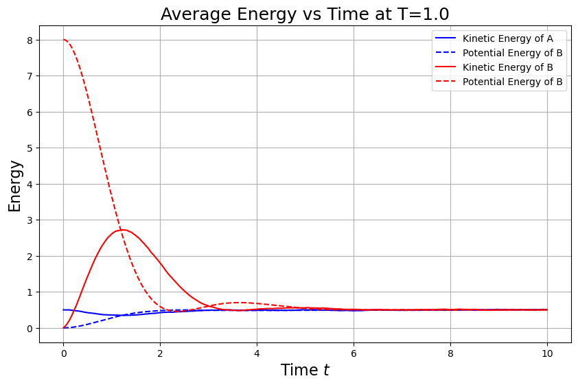
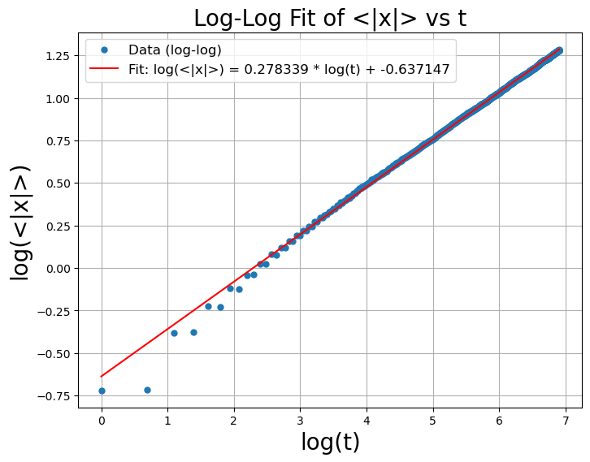

# A. Langevin方程
一个有限温度T下一维粒子的Langevin方程是：
$$m\ddot{q} + \lambda \dot{q} + \frac{\partial V}{\partial q} = \xi(t).$$
其中噪声项$\xi(t)$是一白噪声，其关联函数是
$$\langle \xi(t')\xi(t) \rangle = D^2 \cdot \delta(t - t').$$
## 1. 导出$D^2$和$m, λ, k_B, T$的关系
取势能项V=0，从动能均分定理的角度，热平衡态的粒子具有平均动能$\langle E_k \rangle = \frac{k_BT}{2}$. 利用这一关系导出$D^2$和$m, λ, k_B, T$的关系。思考这一关系的物理意义。(1分)


我们从给定的 Langevin 方程出发，在势能项 $V = 0$ 的情况下，简化为：
$$m\ddot{q} + \lambda \dot{q}  = \xi(t).$$


令 $\dot{q} = v$，上式变成速度形式的随机微分方程：

$$m\dot{v} + \lambda v  = \xi(t),$$


<!-- 
动能的均方值

系统最终会达到热平衡态，对应的动能期望值由能量均分定理给出：


计算 $\langle v^2 \rangle$：稳态自洽解 -->

其稳态解的方差 $\langle v^2 \rangle$ 满足以下关系：
$$\frac{d\langle v^2\rangle}{dt}=-2\frac\lambda m\langle v^2\rangle+\frac{D^2}{m^2}$$

稳态时左边为零，得：

$$0=-2\frac\lambda m\langle v^2\rangle+\frac{D^2}{m^2}$$

则$$\langle v^2\rangle=\frac{D^2}{2\lambda m}$$

又：
$$\langle v^2\rangle = \frac{k_B T}{m}$$

则$$D^2=2\lambda k_BT$$


## 2.数值求解的离散化格式 
为了数值上求解这个问题，你需要数值求解上述SDE问题。请你写出一个离散化的格式。(1分)

给出的方程：
$$m\ddot{q} + \lambda \dot{q} + \frac{\partial V}{\partial q} = \xi(t).$$

我们将该二阶方程拆成两个一阶方程，引入速度$v=\dot{q}$,得到

$$\begin{cases}\dot{q}=v\\\dot{v}=-\frac\lambda mv-\frac1m\frac{\partial V}{\partial q}+\frac1m\xi(t)\end{cases}$$

引入时间步长$\Delta t$,离散化形式如下：

$$\begin{cases}q_{n+1}=q_n+v_n\Delta t\\v_{n+1}=v_n+\left(-\frac\lambda mv_n-\frac1m\frac{\partial V}{\partial q_n}\right)\Delta t+\frac1mD\cdot\sqrt{\Delta t}\cdot\mathcal{N}(0,1)\end{cases}$$

其中：

- $\mathcal{N} ( 0, 1)$表示标准正态分布的高斯白噪声；
- $D=\sqrt{2\lambda k_BT}$,是我们在第1问中推导出的噪声强度；

由此得到离散化的格式：

$$\begin{aligned}q_{n+1}&=q_n+v_n\Delta t\\v_{n+1}&=v_n+\left(-\frac{\lambda}{m}v_n-\frac{1}{m}\frac{\partial V}{\partial q_n}\right)\Delta t+\frac{1}{m}D\cdot\sqrt{\Delta t}\cdot\mathcal{N}(0,1)\end{aligned}$$

但是这个方法的精度不够高；采用henu算法改进：
$$\begin{aligned}&\tilde{q}_{n+1}=q_n+v_n\Delta t\\&\tilde{v}_{n+1}=v_n+\left(-\frac{\lambda}{m}v_n-\frac{1}{m}\frac{\partial V}{\partial q_n}\right)\Delta t+\frac{1}{m}D\cdot\Delta W\\&q_{n+1}=q_n+\frac{1}{2}(v_n+\tilde{v}_{n+1})\Delta t\\&v_{n+1}=v_n+\frac{1}{2}\left[\left(-\frac{\lambda}{m}v_n-\frac{1}{m}\frac{\partial V}{\partial q_n}\right)+\left(-\frac{\lambda}{m}\tilde{v}_{n+1}-\frac{1}{m}\frac{\partial V}{\partial\tilde{q}_{n+1}}\right)\right]\Delta t+\frac{1}{m}D\cdot\Delta W\end{aligned}$$

## 3. 求解问题
取势能项$V=\frac12x^2$且其余参数$k_BT=m=\lambda=1$. 使用SDE的相关算法数值求解下列问题：
### (a).系统平均动能$\langle E_k(t) \rangle$ 和平均势能$\langle V(t) \rangle$的演化
首先取T=1，计算两个初态下的时间演化结果：A.q(0)=0,$\dot{q}(0)=1$ B.q(0)=4,$\dot{q}(0)=0$. 对于每个初态，计算大量粒子的演化轨迹，并对物理量作系综平均，在同一张图画出t∈[0,10]区间上的系统平均动能$\langle E_k(t) \rangle$ 和平均势能$\langle V(t) \rangle$(2分)

在这样的系数下离散化的方程更新为：
$$\begin{aligned}&\tilde{q}_{n+1}=q_n+v_n\Delta t\\&\tilde{v}_{n+1}=v_n+\left(-v_n-q_n\right)\Delta t+\sqrt{2}\Delta W\\&q_{n+1}=q_n+\frac{1}{2}(v_n+\tilde{v}_{n+1})\Delta t\\&v_{n+1}=v_n+\frac{1}{2}\left[\left(-v_n-q_n\right)+\left(-\tilde{v}_{n+1}-\tilde{q}_{n+1}\right)\right]\Delta t+\sqrt{2}\Delta W\end{aligned}$$

$其中\Delta W=\sqrt{\Delta t}\cdot\mathcal{N}(0,1)$在前后保持一致

得到结果：


### (b). 改变温度，求解平均动能$\langle E_k(t) \rangle$ 和平均势能$\langle V(t) \rangle$的演化
自己选择区间，改变温度，画出充分弛豫后系统的平均动能$\langle E_k(\infty) \rangle$ 平均势能$\langle V(\infty) \rangle$. 你从这个结果中发现了什么?(1分) hint: 物理量的系综平均和时间平均有什么关系?

为了方便与(a)中的结果进行对比，选择与A相同的初态，并画出系统平均动能$\langle E_k(\infty) \rangle$ 平均势能$\langle V(\infty) \rangle$：
温度T=0.5；

T=1:

T=2:

T=4:

T=8:


由以上结果可以发现：
1. 对于不同的温度下，平均动能和平均势能随时间变化趋势大体相同，比如B初态下的动能都是先增大后减小的
2. 不同温度下、不同初态下的动能和势能最终都会演化到一个稳定的值，且动能和势能的稳定值相同
3. 动能和势能的稳定值与温度成正比

提取充分弛豫后（时间较长后）动能和势能的平均值，进行验证：


上图证明了上述发现。并且可以观察到，平均动能$\langle E_k(t) \rangle$ 和平均势能$\langle V(t) \rangle$的关系为：
$$\langle E_k(t) \rangle=\langle V(t) \rangle=\frac{T}{2}$$

对不同的温度进行扫描，计算平均动能$\langle E_k(t) \rangle$ 和平均势能$\langle V(t) \rangle$，结果如下：


式子$\langle E_k(t) \rangle=\langle V(t) \rangle=\frac{T}{2}$得到验证。
这对应了能均分定理。


**分析如下：**
从图像和计算结果可以看出，系统在演化一段时间后，无论初始条件如何，平均动能和势能都会趋于稳定。这种行为说明系统达到了稳态或平衡态。

在统计物理中，有一个重要的假设叫做遍历性(ergodicity)假设，它指出在足够长的时间尺度下，一个系统的时间平均等于其系综平均。因此我们可以理解为：

| 时间平均 ≈ 系综平均 |

在这个问题中，我们通过大量粒子的系综平均计算得到了 $\langle E_k(t) \rangle$  和 $\langle V(t) \rangle$，这些平均值趋于稳定，反映出系统在平衡态下的平均行为。由于遍历性成立，我们也可以通过单个粒子在长时间尺度上的轨迹做时间平均来得到同样的结果，这也是许多数值模拟中常用的方法。

而且从图像验证的结论：

$\langle E_k(t) \rangle=\langle V(t) \rangle=\frac{T}{2}$

恰好符合**能量均分定理**(equipartition theorem)**,其中每个自由度在热平衡下平均贡献 $\frac{1}{2}k_B T$（本题单位化取 $k_B=1$）的能量。


<!-- todo -->
### (c). 将势能改为$V=\frac12x^4$
将势能改为$V=\frac12x^4$并重复(b)的计算。你发现了什么差异?怎么理解这一差异?(1分)
将势能改为$V=\frac12x^4$得到：


由上图可知：
1. 平均动能$\langle E_k(t) \rangle$ 和平均势能$\langle V(t) \rangle$的演化随温度线性增加
2. 拟合可知：$$\langle E_k(t) \rangle=\frac{T}{2}$$$$\langle V(t) \rangle=\frac{T}{4}$$
<!-- todo -->
可以从**统计物理角度进行解释**：
#### 1. 对于动能：

对任意势能 $V(x)$，其平衡态的期望值可以通过玻尔兹曼分布：$P(x) \propto exp\left(-\frac{V(x)}{T}\right)$

计算平均动能仍然来自于动能项 $E_k = \frac{1}{2}mv^2$，由均分定理决定：

对每个动自由度，动能平均值为 $\frac{T}{2}$。
#### 2. 对于势能：

我们考虑平均势能的表达式：

\[
\langle V \rangle = \frac{1}{Z} \int_{-\infty}^{\infty} \frac{1}{2}x^4 \cdot e^{-x^4/(2T)} dx
\]

由于 integrand 是偶函数，可以简化为：

\[
\langle V \rangle = \frac{1}{Z} \cdot 2 \int_0^{\infty} \frac{1}{2} x^4 e^{-x^4/(2T)} dx = \frac{1}{Z} \int_0^{\infty} x^4 e^{-x^4/(2T)} dx
\]

配分函数为：

\[
Z = \int_{-\infty}^{\infty} e^{-x^4/(2T)} dx = 2 \int_0^{\infty} e^{-x^4/(2T)} dx
\]

我们对两个积分进行换元，令 \( u = \frac{x^4}{2T} \)，则 \( x = (2T u)^{1/4} \)，且

\[
dx = \frac{d}{du}\left((2T u)^{1/4}\right) du = \frac{1}{4}(2T)^{1/4} u^{-3/4} du
\]

首先计算分子：

\[
\int_0^\infty x^4 e^{-x^4/(2T)} dx = \int_0^\infty (2T u) e^{-u} \cdot \frac{1}{4}(2T)^{1/4} u^{-3/4} du
\]

\[
= \frac{1}{4}(2T)^{5/4} \int_0^\infty u^{1 - 3/4} e^{-u} du = \frac{1}{4}(2T)^{5/4} \int_0^\infty u^{1/4} e^{-u} du
\]

\[
= \frac{1}{4}(2T)^{5/4} \Gamma\left(\frac{5}{4}\right)
\]

再计算分母 \(Z\)：

\[
Z = 2 \int_0^\infty e^{-x^4/(2T)} dx = 2 \int_0^\infty e^{-u} \cdot \frac{1}{4}(2T)^{1/4} u^{-3/4} du
\]

\[
= \frac{1}{2}(2T)^{1/4} \int_0^\infty u^{-3/4} e^{-u} du = \frac{1}{2}(2T)^{1/4} \Gamma\left(\frac{1}{4}\right)
\]

代入总表达式：

\[
\langle V \rangle = \frac{\frac{1}{4}(2T)^{5/4} \Gamma(5/4)}{\frac{1}{2}(2T)^{1/4} \Gamma(1/4)} = \frac{1}{4} \cdot 2T \cdot \frac{\Gamma(5/4)}{\Gamma(1/4)}
\]

利用伽马函数性质 \(\Gamma(x+1) = x \Gamma(x)\)，得：

\[
\Gamma\left(\frac{5}{4}\right) = \frac{1}{4} \Gamma\left(\frac{1}{4}\right)
\]

代入得：

\[
\langle V \rangle = \frac{1}{4} \cdot 2T \cdot \frac{1}{4} = \frac{T}{4}
\]

因此得出结论：

\[
{\langle V \rangle = \frac{T}{4}}
\]


# B.梳子上的随机行走
考虑在一个梳子状的晶格上的随机行走：

1. 粒子$t=0$时刻位于原点$(x,y)=(0,0).$
2. 粒子每步进行随机行走，等可能选取所有可以前进的方向，并前进一步。
3. 晶格是梳子形的，粒子在x轴上时，可以自由选择四个前进的方向。如果不在x轴上，则只能上下移动。
你需要求解：
## 1.平均水平位移的演化
该随机运动过程中，平均水平位移$\langle|x|\rangle$和时间$t$的关系。(1.5分)
因为该题背景下没有限制格点的大小，因此采用记录各地位置的方案。
得到结果：
先观察在一段相对较短的时间内：

由上图可以发现：
1. $\langle|x|\rangle$的增长有很明显的阶梯状增长的特点
2. 当$t$为奇数时，$\langle|x|\rangle$保持不变，当$t$为偶数时，$\langle|x|\rangle$增长。
3. 时间越长，当$t$为偶数时，$\langle|x|\rangle$增长但增长的量越小，整体上逐渐趋平滑。

在一个更长的时间尺度上来看$\langle|x|\rangle$的变化：


由上图可以看到，在长时间尺度下，$\langle|x|\rangle$的增长曲线区域非常平滑，始终保持增长，且随着时间的增长，增长速度逐渐放缓。由此猜测$\langle|x|\rangle$与$t$之间可能存在幂律关系。
对$\langle|x|\rangle$和$t$同时取对数，得到：


上图观察可得：
1. $\langle|x|\rangle$的增长有很明显的阶梯状增长的特点
2. 在长时间尺度上来看，$log(\langle|x|\rangle)$与$log(t)$之间存在很好的线性性。

进行直线拟合：


上图展现了$log(\langle|x|\rangle)$与$log(t)$之间的关系：
$$log(\langle|x|\rangle) = 0.278log(t) -0.637$$
即：$$\langle|x|\rangle =e^{-0.637}t^{0.278} $$

在这一关系之外，还可以观察得当时间较小时数据的分布于直线下方，说明时间较小时有脱离幂律的现象。

不妨考虑从t=250开始拟合，得到结果：


结果近似$$\langle|x|\rangle =t^{\frac{1}{4}} $$后面会进行分析。
## 2.对比一维随机行走
对比一维随机行走，它们有什么差异？(1.5分)

模拟计算一维随机行走，思路与前述相同：

长时间尺度下：
、
log后拟合：

得到：
即：$$\langle|x|\rangle =e^{-0.217}t^{0.499} $$
近似$$\langle|x|\rangle \sim t^{0.5} $$，后面会进行分析。

进行对比：

可以看出
1. 两种扩撒都符合幂律关系
2. 梳子扩散的速度慢于一维随机扩散
3. 一维随机分布在取对数后有更加严格的线性性，说明其在整个时间尺度下对于$$\langle|x|\rangle =e^{-0.217}t^{0.499} $$这一关系都符合的很好
## 3.解释规律

**解释为什么梳子扩散$\langle|x(t)|\rangle\sim t^{1/4}$**
在x轴上，粒子有4个方向可选：左、右、上、下；在y≠0处，只能上下移动(2个方向)。  
因此，粒子只有在y=0时才能移动x坐标，其他时候x保持不变。这极大地限制了水平扩散。  
我们把这个模型等效成一个连续时间随机行走过程中的等待时间效应，也就是：  
每进行一次x方向的移动，平均要花很多步在y方向上来“返回”x轴。  
具体估算：  
- 假设粒子每次在x轴上有概率$\frac{1}{2}$选择“上下”移动而离开x轴；
- 一旦离开x轴，它就执行一维的垂直随机游走，直到返回x轴；
- 一维随机行走的返回时间分布满足：返回原点的平均时间是$\infty$（但是返回的概率为1，即最终一定能回来）。
但我们可以取一个有限步长$t$，估算其中能回到x轴的步数是$$N_x \sim t^{1/2}$$

得到：

$$\langle|x(t)|\rangle\sim\left(t^{1/2}\right)^{1/2}=t^{1/4}$$

此外，对于一些其他现象的解释：
1. **锯齿状分布**：
    由于体系关于x=0对称，因此关键在于x=0处粒子的影响。
    当t=0时，p(x=0)=1，则$\langle|x(t)|\rangle$必然增加；当t=1时，p(x=0)=0，则$\langle|x(t)|\rangle$不变。
    以此类推，当$t$为奇数时，$\langle|x|\rangle$保持不变，当$t$为偶数时，$\langle|x|\rangle$增长。
2. 关于时间较小的时候梳子**扩散脱离幂律**：
    - 初始态影响强烈：粒子初始位于原点 (x=0, y=0)，在前几步内，粒子尚未有足够时间向y方向大幅偏离，因此仍有较高概率停留在x轴或快速返回x轴，从而产生较频繁的x方向运动。

    - 样本波动大：在小t范围内，每一次粒子的路径差异对平均值的影响更大，导致$\langle|x(t)|\rangle$的统计波动较大，不稳定。

# 附录：
## A
``` python
import numpy as np
import matplotlib.pyplot as plt

# ----------------------------
# 势能函数与其导数
# ----------------------------
def V(q: float) -> float:
    return 0.5 * q**4

def dV_dq(q: float) -> float:
    return 2*q**3
# ----------------------------
# Heun 方法模拟 Langevin 动力学，记录能量演化
# ----------------------------
def heun_for_kinetic_and_potential(q0: float, v0: float) -> tuple[np.ndarray, np.ndarray]:
    q = np.zeros((N_particles, N_steps + 1))
    v = np.zeros((N_particles, N_steps + 1))
    q[:, 0] = q0
    v[:, 0] = v0

    kinetic = np.zeros(N_steps + 1)
    potential = np.zeros(N_steps + 1)
    kinetic[0] = np.sum(0.5 * v[:, 0]**2) / N_particles
    potential[0] = np.sum(0.5 * q[:, 0]**2) / N_particles

    for i in range(N_steps):
        dW = np.random.normal(0, np.sqrt(dt), N_particles)

        v_tilde = v[:, i] + (-v[:, i] - dV_dq(q[:, i])) * dt + D * dW
        q_tilde = q[:, i] + v[:, i] * dt

        v[:, i + 1] = v[:, i] + 0.5 * ((-v[:, i] - dV_dq(q[:, i])) + (-v_tilde - dV_dq(q_tilde))) * dt + D * dW
        q[:, i + 1] = q[:, i] + 0.5 * (v[:, i] + v_tilde) * dt

        kinetic[i + 1] = np.sum(0.5 * v[:, i + 1]**2) / N_particles
        potential[i + 1] = np.sum(0.5 * q[:, i + 1]**2) / N_particles

    return kinetic, potential

# ----------------------------
# 画出 A 与 B 两个初态下能量演化
# ----------------------------
def plot_kinetic_and_potential_energy(E_k_over_time_A, V_over_time_A, E_k_over_time_B, V_over_time_B):
    plt.figure(figsize=(10, 6))
    plt.plot(t, E_k_over_time_A, label='Kinetic Energy (A)', color='blue')
    plt.plot(t, V_over_time_A, label='Potential Energy (A)', color='blue', linestyle='--')
    plt.plot(t, E_k_over_time_B, label='Kinetic Energy (B)', color='red')
    plt.plot(t, V_over_time_B, label='Potential Energy (B)', color='red', linestyle='--')
    plt.xlabel('Time $t$', fontsize=20)
    plt.ylabel('Energy', fontsize=20)
    plt.title('Evolution of Ensemble-Averaged Kinetic and Potential Energy', fontsize=20)
    plt.legend()
    plt.grid(True)
    plt.savefig('./figures/A_1_V=0.25X2.png', bbox_inches='tight')
    plt.show()

# ----------------------------
# 改变温度，计算充分弛豫后的平均能量
# ----------------------------
def scan_temperature(T_list: list[float], q0: float = 0.0, v0: float = 1.0):
    avg_Ek = []
    avg_V = []

    for T in T_list:
        global D
        D = np.sqrt(2 * T)

        kinetic, potential = heun_for_kinetic_and_potential(q0, v0)

        # 弛豫后取最后 20% 做时间平均
        start_idx = int(0.95 * len(kinetic))
        Ek_inf = np.mean(kinetic[start_idx:])
        V_inf = np.mean(potential[start_idx:])

        avg_Ek.append(Ek_inf)
        avg_V.append(V_inf)

    # 作图
    plt.figure(figsize=(8, 6))
    plt.plot(T_list, avg_Ek, 'o-', label=r'$\langle E_k(\infty) \rangle$')
    plt.plot(T_list, avg_V, 's--', label=r'$\langle V(\infty) \rangle$')
    plt.plot(T_list, [0.5*T for T in T_list], 'k--', label=r'$0.5T$')
    plt.xlabel('Temperature $T$', fontsize=16)
    plt.ylabel('Average Energy', fontsize=16)
    plt.title('Long-Time Average Energy vs Temperature', fontsize=18)
    plt.legend()
    plt.grid(True)
    plt.savefig('./figures/temperature_scan_V=0.25X2.png', bbox_inches='tight')
    plt.show()

# ----------------------------
# 主程序入口
# ----------------------------
if __name__ == "__main__":
    # 参数设置
    T_total = 20.0
    dt = 0.01
    N_steps = int(T_total / dt)
    N_particles = 10000
    D = np.sqrt(2)  # 初始温度 T=1 的扩散强度
    t = np.linspace(0, T_total, N_steps + 1)

    # (a) 不同初态下能量演化
    E_k_A_time, V_A_time = heun_for_kinetic_and_potential(q0=0, v0=1)
    E_k_B_time, V_B_time = heun_for_kinetic_and_potential(q0=4, v0=0)
    plot_kinetic_and_potential_energy(E_k_A_time, V_A_time, E_k_B_time, V_B_time)

    # (b) 改变温度，分析充分弛豫后能量
    T_list = np.linspace(0.5, 5.0, 10)
    scan_temperature(T_list)

```

## B
```python
import numpy as np
import matplotlib.pyplot as plt
import random as rand

## 先设定可选的移动组合
choices = [
    np.array([0, 1]),
    np.array([0, -1]),
    np.array([1, 0]),
    np.array([-1, 0])
]

def move(position:np.ndarray,choices:list)->np.ndarray:
    if position[1]==0:
        choice = rand.randint(0,4)
        position+=choices[choice]
    else:
        choice = rand.randint(0,2)
        position+=choices[choice]
    return position


def partical_random_walk(t:int)->np.ndarray:
    position = np.ndarray[0,0]
    time_position = np.zeros(t,2)
    for i in range(t):
        position = move(position,choices)
        time_position[i,:] = position
    return time_position

def calculate_x_abs_mean(t0:int,tf: int, num: int, choices: list) -> np.ndarray:
    time_ndarray = np.arange(t0, tf)
    x_mean = np.zeros(tf)
    for j in range(num):
        position = np.array([0, 0])  # 修复 np.ndarray 的错误用法
        for i in range(tf):
            x_mean[i] += abs(position[0])  # 修复索引访问错误
            if position[1] == 0:
                choice = rand.randint(0, 3)  # 修复索引范围错误
                position += choices[choice]
            else:
                choice = rand.randint(0, 1)
                position += choices[choice]
    x_mean = x_mean[t0:tf]
    return x_mean / num,time_ndarray


def calculate_x_abs_mean_one_D(t0:int,tf: int,N_particle:int) -> np.ndarray:
    time_ndarray = np.arange(tf)
    x_abs_mean = np.zeros(tf)
    position = np.zeros((tf,N_particle) )
    position[0,:] = 0
    x_abs_mean[0] = np.sum(np.abs(position[0,:]))
    for time in range(tf-1):
        for particle in range(N_particle):
            position[time+1,particle] = position[time,particle] + np.random.choice([-1,1])
        x_abs_mean[time+1] = np.sum(np.abs(position[time+1,:]))
    x_abs_mean = x_abs_mean [t0:tf]
    return x_abs_mean/N_particle,time_ndarray[t0:tf]

def plot_x_abs_mean_log(x_mean:np.ndarray,t:int):
    plt.plot(x_mean)
    plt.xscale('log')
    plt.yscale('log')
    plt.xlabel('log(t)',fontsize=20)
    plt.ylabel(r'log(<|x|>)',fontsize=20)
    plt.title(r'resolution of <|x|>',fontsize=20)
    plt.grid(True)
    path = f"./figures/B_log_t={t}.png"
    plt.savefig(path, bbox_inches='tight')
    
    plt.show()

def plot_x_abs_mean(x_mean:np.ndarray,t:int):
    plt.plot(x_mean)
    plt.xlabel('time',fontsize=20)
    plt.ylabel('x_mean',fontsize=20)
    plt.title(r'resolution of <|x|>',fontsize=20)
    plt.grid(True)
    path = f"./figures/B_t={t}.png"
    plt.savefig(path, bbox_inches='tight')
    plt.show()

# def plot_x_abs_mean_log_fit(x_mean:np.ndarray,t:int,time_ndarry:np.ndarray):
#     x_mean = np.log(x_mean)
#     time_ndarry = np.log(time_ndarry)
#     plt.plot(time_ndarry,x_mean,label='data')
#     parmas = np.polyfit(time_ndarry,x_mean,1)
#     slope,intercept = parmas
#     plt.plot(time_ndarry,np.polyval(parmas,time_ndarry),'r',label =f'log<|x|> = {slope}*log(t)+{intercept}')
#     plt.xlabel('log(t)',fontsize=20)
#     plt.ylabel(r'log(<|x|>)',fontsize=20)
#     plt.title(r'resolution of <|x|>',fontsize=20)
#     plt.grid(True)
#     path = f"./figures/B_log_t={t}_fit.png"
#     plt.savefig(path, bbox_inches='tight')
#     plt.show()
    

def plot_x_abs_mean_log_fit(x_mean: np.ndarray, t: int,t0:int, time_ndarray: np.ndarray):
    # 对 x_mean 和 time_ndarray 取对数
    log_x_mean = np.log(x_mean)
    log_time_ndarray = np.log(time_ndarray)

    # 进行线性拟合
    params = np.polyfit(log_time_ndarray, log_x_mean, 1)
    slope, intercept = params

    # 绘制数据点和拟合直线
    plt.figure(figsize=(8, 6))
    plt.plot(log_time_ndarray, log_x_mean, 'o', label='Data (log-log)', markersize=5)
    plt.plot(log_time_ndarray, np.polyval(params, log_time_ndarray), 'r-', 
             label=f'Fit: log(<|x|>) = {slope:.6f} * log(t) + {intercept:.6f}')

    # 设置图形属性
    plt.xlabel('log(t)', fontsize=20)
    plt.ylabel(r'log(<|x|>)', fontsize=20)
    plt.title(r'Log-Log Fit of <|x|> vs t', fontsize=20)
    plt.legend(fontsize=12)
    plt.grid(True)

    # 保存图像
    path = f"./figures/B_log_from_{t0}_to_{t}_fit.png"
    plt.savefig(path, bbox_inches='tight')
    plt.show()
def plot_x_abs_mean_logfit(x_mean: np.ndarray, t: int, t0: int, time_ndarray: np.ndarray):
    # 对 time_ndarray 取对数
    log_time_ndarray = np.log(time_ndarray)

    # 进行线性拟合，拟合形式为 x = a * ln(t) + b
    params = np.polyfit(log_time_ndarray, x_mean, 1)
    a, b = params

    # 绘制数据点和拟合直线
    plt.figure(figsize=(8, 6))
    plt.plot(log_time_ndarray, x_mean, 'o', label='Data (log-linear)', markersize=5)
    plt.plot(log_time_ndarray, np.polyval(params, log_time_ndarray), 'r-', 
             label=f'Fit: x = {a:.6f} * ln(t) + {b:.6f}')

    # 设置图形属性
    plt.xlabel('ln(t)', fontsize=20)
    plt.ylabel(r'<|x|>', fontsize=20)
    plt.title(r'Log-Linear Fit of <|x|> vs ln(t)', fontsize=20)
    plt.legend(fontsize=12)
    plt.grid(True)

    # 保存图像
    path = f"./figures/B_loglinear_from_{t0}_to_{t}_fit.png"
    plt.savefig(path, bbox_inches='tight')
    plt.show()

def plot_one_D(x_mean:np.ndarray,t:int,t0:int,time_ndarry:np.ndarray):
    plt.plot(time_ndarry,x_mean)
    plt.xlabel('time',fontsize=20)
    plt.ylabel('x_mean',fontsize=20)
    plt.title(r'resolution of <|x|> in 1D random walk',fontsize=20)
    plt.grid(True)
    path = f"./figures/B_t={t}_from_{t0}_1D.png"
    plt.savefig(path, bbox_inches='tight')
    plt.show()


def plot_one_D_fit(x_mean:np.ndarray,t:int,t0:int,time_ndarry:np.ndarray):
    x_mean_log = np.log(x_mean)
    time_ndarry_log = np.log(time_ndarry)

    params = np.polyfit(time_ndarry_log, x_mean_log, 1)
    slope, intercept = params
    plt.figure(figsize=(8, 6))
    plt.plot(time_ndarry_log, x_mean_log, 'o', label='Data', markersize=4)
    plt.plot(time_ndarry_log, np.polyval(params, time_ndarry_log), 'r-', 
             label=f'Fit: log(<|x|>) = {slope:.6f} * log(t) + {intercept:.6f}') 
    plt.xlabel('log(t)', fontsize=20)
    plt.ylabel(r'log(<|x|>)', fontsize=20)
    plt.title(r'Log-Log Fit of <|x|> vs t in 1D random walk', fontsize=20)
    plt.legend(fontsize=12)
    plt.grid(True)
    path = f"./figures/B_log_from_{t0}_to_{t}_fit_1D.png"   
    plt.savefig(path, bbox_inches='tight')
    plt.show()

def plot_both(x_mean:np.ndarray,x_mean_1D:np.ndarray,t:int,t0:int,time_ndarry:np.ndarray):
    plt.plot(time_ndarry,x_mean,label='chomb random walk')
    plt.plot(time_ndarry_1D,x_mean_1D,label='1D random walk')
    plt.xlabel('time',fontsize=20)
    plt.ylabel('x_mean',fontsize=20)
    plt.title(r'resolution of <|x|>',fontsize=20)
    plt.grid(True)
    plt.legend()
    path = f"./figures/B_both_t={t}_from_{t0}_both.png"
    plt.savefig(path, bbox_inches='tight')
    plt.show()


if __name__ == '__main__':
    t = 1000
    num = 10000
    t0=1
    x_mean,time_ndarry = calculate_x_abs_mean(t0,t,num,choices)
    # # plot_x_abs_mean(x_mean,t)
    # # plot_x_abs_mean_log(x_mean)
    # # print(x_mean[:20])
    plot_x_abs_mean_logfit(x_mean,t,t0,time_ndarry)
    x_mean_1D,time_ndarry_1D = calculate_x_abs_mean_one_D(t0,t,num)
    print(x_mean_1D[1])
    print(time_ndarry_1D[1])
    plot_one_D_fit(x_mean_1D,t,t0,time_ndarry_1D)
    plot_both(x_mean,x_mean_1D,t,t0,time_ndarry)
    
```

