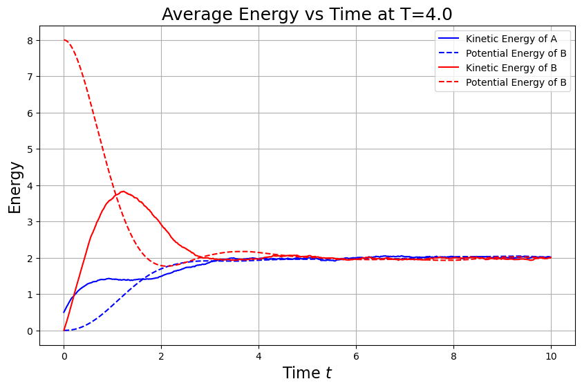
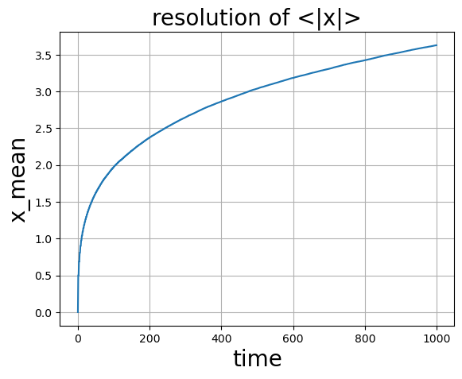

# A. Langevin方程
一个有限温度T下一维粒子的Langevin方程是：
$$m\ddot{q} + \lambda \dot{q} + \frac{\partial V}{\partial q} = \xi(t).$$
其中噪声项$\xi(t)$是一白噪声，其关联函数是
$$\langle \xi(t')\xi(t) \rangle = D^2 \cdot \delta(t - t').$$
## 1. 导出$D^2$和$m, λ, k_B, T$的关系
取势能项V=0，从动能均分定理的角度，热平衡态的粒子具有平均动能$\langle E_k \rangle = \frac{k_BT}{2}$. 利用这一关系导出$D^2$和$m, λ, k_B, T$的关系。思考这一关系的物理意义。(1分)

我们从给定的 Langevin 方程出发，在势能项 $V = 0$ 的情况下，简化为：
$$m\ddot{q} + \lambda \dot{q}  = \xi(t).$$

令 $\dot{q} = v$，上式变成速度形式的随机微分方程：

$$m\dot{v} + \lambda v  = \xi(t),$$

<!-- 
动能的均方值

系统最终会达到热平衡态，对应的动能期望值由能量均分定理给出：

计算 $\langle v^2 \rangle$：稳态自洽解 -->

其稳态解的方差 $\langle v^2 \rangle$ 满足以下关系：
$$\frac{d\langle v^2\rangle}{dt}=-2\frac\lambda m\langle v^2\rangle+\frac{D^2}{m^2}$$

稳态时左边为零，得：

$$0=-2\frac\lambda m\langle v^2\rangle+\frac{D^2}{m^2}$$

则$$\langle v^2\rangle=\frac{D^2}{2\lambda m}$$

又：
$$\langle v^2\rangle = \frac{k_B T}{m}$$

则$$D^2=2\lambda k_BT$$

## 2.数值求解的离散化格式 
为了数值上求解这个问题，你需要数值求解上述SDE问题。请你写出一个离散化的格式。(1分)

给出的方程：
$$m\ddot{q} + \lambda \dot{q} + \frac{\partial V}{\partial q} = \xi(t).$$

我们将该二阶方程拆成两个一阶方程，引入速度$v=\dot{q}$,得到

$$\begin{cases}\dot{q}=v\\\dot{v}=-\frac\lambda mv-\frac1m\frac{\partial V}{\partial q}+\frac1m\xi(t)\end{cases}$$

引入时间步长$\Delta t$,离散化形式如下：

$$\begin{cases}q_{n+1}=q_n+v_n\Delta t\\v_{n+1}=v_n+\left(-\frac\lambda mv_n-\frac1m\frac{\partial V}{\partial q_n}\right)\Delta t+\frac1mD\cdot\sqrt{\Delta t}\cdot\mathcal{N}(0,1)\end{cases}$$

其中：

- $\mathcal{N} ( 0, 1)$表示标准正态分布的高斯白噪声；
- $D=\sqrt{2\lambda k_BT}$,是我们在第1问中推导出的噪声强度；

由此得到离散化的格式：

$$\begin{aligned}q_{n+1}&=q_n+v_n\Delta t\\v_{n+1}&=v_n+\left(-\frac{\lambda}{m}v_n-\frac{1}{m}\frac{\partial V}{\partial q_n}\right)\Delta t+\frac{1}{m}D\cdot\sqrt{\Delta t}\cdot\mathcal{N}(0,1)\end{aligned}$$

但是这个方法的精度不够高；采用henu算法改进：
$$\begin{aligned}&\tilde{q}_{n+1}=q_n+v_n\Delta t\\&\tilde{v}_{n+1}=v_n+\left(-\frac{\lambda}{m}v_n-\frac{1}{m}\frac{\partial V}{\partial q_n}\right)\Delta t+\frac{1}{m}D\cdot\Delta W\\&q_{n+1}=q_n+\frac{1}{2}(v_n+\tilde{v}_{n+1})\Delta t\\&v_{n+1}=v_n+\frac{1}{2}\left[\left(-\frac{\lambda}{m}v_n-\frac{1}{m}\frac{\partial V}{\partial q_n}\right)+\left(-\frac{\lambda}{m}\tilde{v}_{n+1}-\frac{1}{m}\frac{\partial V}{\partial\tilde{q}_{n+1}}\right)\right]\Delta t+\frac{1}{m}D\cdot\Delta W\end{aligned}$$

## 3. 求解问题
取势能项$V=\frac12x^2$且其余参数$k_BT=m=\lambda=1$. 使用SDE的相关算法数值求解下列问题：
### (a).系统平均动能$\langle E_k(t) \rangle$ 和平均势能$\langle V(t) \rangle$的演化
首先取T=1，计算两个初态下的时间演化结果：A.q(0)=0,$\dot{q}(0)=1$ B.q(0)=4,$\dot{q}(0)=0$. 对于每个初态，计算大量粒子的演化轨迹，并对物理量作系综平均，在同一张图画出t∈[0,10]区间上的系统平均动能$\langle E_k(t) \rangle$ 和平均势能$\langle V(t) \rangle$(2分)

在这样的系数下离散化的方程更新为：
$$\begin{aligned}&\tilde{q}_{n+1}=q_n+v_n\Delta t\\&\tilde{v}_{n+1}=v_n+\left(-v_n-q_n\right)\Delta t+\sqrt{2}\Delta W\\&q_{n+1}=q_n+\frac{1}{2}(v_n+\tilde{v}_{n+1})\Delta t\\&v_{n+1}=v_n+\frac{1}{2}\left[\left(-v_n-q_n\right)+\left(-\tilde{v}_{n+1}-\tilde{q}_{n+1}\right)\right]\Delta t+\sqrt{2}\Delta W\end{aligned}$$

$其中\Delta W=\sqrt{\Delta t}\cdot\mathcal{N}(0,1)$在前后保持一致

得到结果：

### (b). 改变温度，求解平均动能$\langle E_k(t) \rangle$ 和平均势能$\langle V(t) \rangle$的演化
自己选择区间，改变温度，画出充分弛豫后系统的平均动能$\langle E_k(\infty) \rangle$ 平均势能$\langle V(\infty) \rangle$. 你从这个结果中发现了什么?(1分) hint: 物理量的系综平均和时间平均有什么关系?

为了方便与(a)中的结果进行对比，选择与A相同的初态，并画出系统平均动能$\langle E_k(\infty) \rangle$ 平均势能$\langle V(\infty) \rangle$：
温度T=0.5；

T=1:

T=2:

T=4:

T=8:

由以上结果可以发现：
1. 对于不同的温度下，平均动能和平均势能随时间变化趋势大体相同，比如B初态下的动能都是先增大后减小的
2. 不同温度下、不同初态下的动能和势能最终都会演化到一个稳定的值，且动能和势能的稳定值相同
3. 动能和势能的稳定值与温度成正比

提取充分弛豫后（时间较长后）动能和势能的平均值，进行验证：

上图证明了上述发现。并且可以观察到，平均动能$\langle E_k(t) \rangle$ 和平均势能$\langle V(t) \rangle$的关系为：
$$\langle E_k(t) \rangle=\langle V(t) \rangle=\frac{T}{2}$$

对不同的温度进行扫描，计算平均动能$\langle E_k(t) \rangle$ 和平均势能$\langle V(t) \rangle$，结果如下：

式子$\langle E_k(t) \rangle=\langle V(t) \rangle=\frac{T}{2}$得到验证。
这对应了能均分定理。
<!-- todo -->
### (c). 将势能改为$V=\frac12x^4$
将势能改为$V=\frac12x^4$并重复(b)的计算。你发现了什么差异?怎么理解这一差异?(1分)
将势能改为$V=\frac12x^4$得到：

<!-- todo -->

# B.梳子上的随机行走
考虑在一个梳子状的晶格上的随机行走：

1. 粒子$t=0$时刻位于原点$(x,y)=(0,0).$
2. 粒子每步进行随机行走，等可能选取所有可以前进的方向，并前进一步。
3. 晶格是梳子形的，粒子在x轴上时，可以自由选择四个前进的方向。如果不在x轴上，则只能上下移动。
你需要求解：
## 1.平均水平位移的演化
该随机运动过程中，平均水平位移$\langle|x|\rangle$和时间$t$的关系。(1.5分)

因为该题背景下没有限制格点的大小，因此采用记录各地位置的方案。

## 2.对比一维随机行走
对比一维随机行走，它们有什么差异？(1.5分)
## 3.解释规律
尝试解释你发现的规律。(1分)