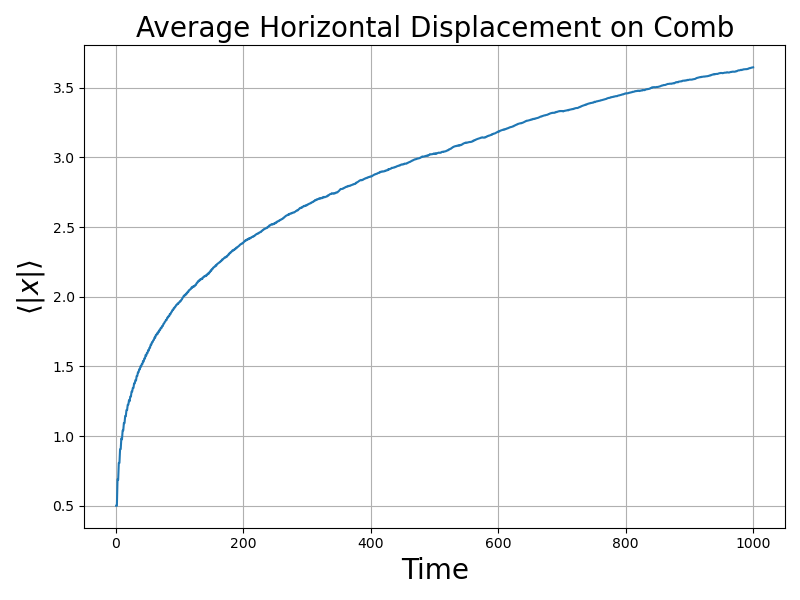
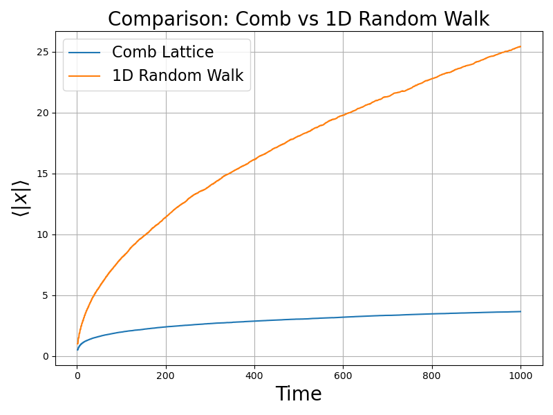

# Langevin 方程的数值仿真与分析

## 题目

一个有限温度 \( T \) 下的一维粒子的 Langevin 方程为：
$$
m\ddot{q} + \lambda \dot{q} + \frac{\partial V}{\partial q} = \xi(t),
$$
其中噪声项 \( \xi(t) \) 是一个白噪声，其关联函数为：
$$
\langle \xi(t')\xi(t)\rangle = D^2\delta(t-t').
$$

### 1. 推导 \( D^2 \) 与 \( m, \lambda, k_BT \) 的关系

已知势能项 \( V = 0 \)，根据能均分定理，热平衡态粒子具有的平均动能为：
$$
\langle E_k \rangle = \frac{1}{2}k_B T.
$$
动能的计算公式为：
$$
\langle E_k \rangle = \frac{1}{2}m\langle \dot{q}^2 \rangle.
$$
由于噪声强度 \( D^2 \) 与耗散系数 \( \lambda \) 满足涨落-耗散关系：
$$
D^2 = 2 \lambda k_B T.
$$

这一关系的物理意义是：热平衡状态下，热噪声的强度 \( D^2 \) 的大小由系统的温度 \( T \) 和阻尼强度 \( \lambda \)共同决定。

---

### 2. Langevin 方程的数值离散化格式

采用时间步长 \( \Delta t \)，用欧拉法对 Langevin 方程进行离散化处理，得到以下差分方程：

**离散速度更新格式**：
$$
v(t + \Delta t) = v(t) + \Delta t \cdot \left(-\frac{\lambda}{m}v(t) - \frac{\partial V(q(t))}{m}\right) + \sqrt{\frac{D^2}{\Delta t \cdot m^2}} \cdot \eta,
$$

**离散位置更新格式**：
$$
q(t + \Delta t) = q(t) + \Delta t \cdot v(t),
$$

其中，噪声 \( \eta \sim \mathcal{N}(0, 1) \) 是标准正态分布随机数。

---

### 3. 数值仿真实验

以下实验在 \( V(q) = \frac{1}{2}q^2 \)（二次势能）和 \( V(q) = \frac{1}{2}q^4 \)（四次势能）下分别进行。

---

#### **3(a) 动能与势能的时间演化**

参数设定如下：
- \( k_B = 1, T = 1, m = 1, \lambda = 1 \)；
- 初始条件：
  - Case A: \( q(0) = 0, \dot{q}(0) = 1 \)；
  - Case B: \( q(0) = 4, \dot{q}(0) = 0 \)；
- 时间步长 \( \Delta t = 0.01 \)，总步数 \( n_{\text{steps}} = 1000 \)，粒子数 \( n_{\text{particles}} = 1000 \)。

得到了每个初态下的动能 \( \langle E_k(t) \rangle \) 和势能 \( \langle V(t) \rangle \) 的时间演化轨迹。

```python
import numpy as np
import matplotlib.pyplot as plt
import os

# 创建保存图片的文件夹
os.makedirs("./figures", exist_ok=True)

# 系统基本参数
m = 1.0        # 质量
gamma = 1.0    # 阻尼系数 (lambda)
k_B = 1.0      # Boltzmann 常数
T = 1.0        # 温度
D2 = 2 * gamma * k_B * T  # 噪声强度
dt = 0.01      # 时间步长
n_steps = 1000  # 时间步数
n_particles = 1000  # 粒子数

# 势能函数及其梯度
def V_quad(q):
    return 0.5 * q**2  # 二次势能

def force_quad(q):
    return -q  # 二次势能对应的力

# Langevin 整体求解器
def langevin_solver(force, n_particles, n_steps, dt, initial_conditions):
    q, v = initial_conditions
    q_traj = np.zeros((n_particles, n_steps))  # 位置轨迹
    v_traj = np.zeros((n_particles, n_steps))  # 速度轨迹
    q_traj[:, 0], v_traj[:, 0] = q, v

    sqrt_Dt_m = np.sqrt(D2 * dt / m**2)
    
    for t in range(1, n_steps):
        noise = sqrt_Dt_m * np.random.randn(n_particles)  # 白噪声
        v = v + dt * (-gamma / m * v + force(q) / m) + noise  # 更新速度
        q = q + dt * v  # 更新位置
        q_traj[:, t] = q
        v_traj[:, t] = v
    
    return q_traj, v_traj

# 计算系综平均值
def compute_ensemble_averages(q_traj, v_traj, V_func):
    E_k = 0.5 * m * np.mean(v_traj**2, axis=0)  # 动能
    V = np.mean(V_func(q_traj), axis=0)  # 势能
    return E_k, V

# 模拟二次势能下的演化
def simulate_quadratic_potential():
    timesteps = np.arange(n_steps) * dt

    # 初始条件
    initial_conditions_A = (np.zeros(n_particles), np.ones(n_particles))  # A: q(0)=0, v(0)=1
    initial_conditions_B = (np.ones(n_particles) * 4, np.zeros(n_particles))  # B: q(0)=4, v(0)=0

    # 求解 Langevin 方程
    q_traj_A, v_traj_A = langevin_solver(force_quad, n_particles, n_steps, dt, initial_conditions_A)
    q_traj_B, v_traj_B = langevin_solver(force_quad, n_particles, n_steps, dt, initial_conditions_B)

    # 计算系综平均值
    E_k_A, V_A = compute_ensemble_averages(q_traj_A, v_traj_A, V_quad)
    E_k_B, V_B = compute_ensemble_averages(q_traj_B, v_traj_B, V_quad)

    # 绘制结果
    plt.figure(figsize=(10, 6))
    plt.plot(timesteps, E_k_A, label=r'$E_k$ (A: Initial $q=0, v=1$)', linewidth=2)
    plt.plot(timesteps, V_A, label=r'$V$ (A: Initial $q=0, v=1$)', linewidth=2)
    plt.plot(timesteps, E_k_B, label=r'$E_k$ (B: Initial $q=4, v=0$)', linestyle='--', linewidth=2)
    plt.plot(timesteps, V_B, label=r'$V$ (B: Initial $q=4, v=0$)', linestyle='--', linewidth=2)
    plt.xlabel('Time', fontsize=20)
    plt.ylabel('Energy', fontsize=20)
    plt.legend(fontsize=15)
    plt.title(r'Evolution of $\langle E_k(t) \rangle$ and $\langle V(t) \rangle$ (Quadratic $V$)', fontsize=20)
    plt.savefig('./figures/quadratic_energy_evolution.png')
    plt.show()

simulate_quadratic_potential()
```

$ \langle$ E_k(t)$ \rangle$  $和 \langle V(t) \rangle $随时间的演化曲线:

<!-- # todo -->

#### **3(b) 不同温度下的动能与势能**

对于势能函数 \( V = \frac{1}{2}q^2 \)，我们改变温度 \( T \) 的值，观察系统在充分弛豫后动能 (\( \langle E_k \rangle \)) 和势能 (\( \langle V \rangle \)) 的变化。

在热平衡状态下，根据能均分定理，期望值为：
\[
\langle E_k \rangle = \langle V \rangle = \frac{1}{2}k_B T.
\]

#### 代码实现

```python
# 模拟不同温度下的动能和势能均值
def simulate_quadratic_potential_for_temperatures():
    temperatures = [1.0, 2.0, 3.0, 4.0]  # 设置不同温度
    equilibrium_kinetic = []  # 动能均值
    equilibrium_potential = []  # 势能均值
    
    for T in temperatures:
        global D2  # 更新噪声强度
        D2 = 2 * gamma * k_B * T  # 噪声随温度改变

        # 初始化条件 (选择初始值 q=0, v=0)
        initial_conditions = (np.zeros(n_particles), np.zeros(n_particles))
        
        # Langevin 动力学求解
        q_traj, v_traj = langevin_solver(force_quad, n_particles, n_steps, dt, initial_conditions)

        # 在平衡态统计
        E_k, V = compute_ensemble_averages(q_traj, v_traj, V_quad)
        equilibrium_kinetic.append(E_k[-1])  # 平衡态的动能取最后值
        equilibrium_potential.append(V[-1])  # 平衡态的势能取最后值

    # 绘制动能与势能的温度依赖性
    plt.figure(figsize=(10, 6))
    plt.plot(temperatures, equilibrium_kinetic, 'o-', label=r'$\langle E_k \rangle$', linewidth=2)
    plt.plot(temperatures, equilibrium_potential, 's-', label=r'$\langle V \rangle$', linewidth=2)
    plt.xlabel('Temperature $T$', fontsize=20)
    plt.ylabel('Energy', fontsize=20)
    plt.legend(fontsize=15)
    plt.title('Energy vs Temperature for Quadratic Potential', fontsize=20)
    plt.savefig('./figures/quadratic_energy_vs_temperature.png')
    plt.show()

simulate_quadratic_potential_for_temperatures()
```

#### **3(c) 四次势能下的行为**

将势能替换为 \( V = \frac{1}{2}q^4 \)，即非二次势能，改变 \( T \) 并重复 (b) 的实验，观察系统充分弛豫后动能和势能性质的变化。

#### 修改的代码实现

```python
# 重定义四次势能及其力
def V_quartic(q):
    return 0.5 * q**4

def force_quartic(q):
    return -2 * q**3

# 模拟四次势能下的温度依赖性
def simulate_quartic_potential_for_temperatures():
    temperatures = [1.0, 2.0, 3.0, 4.0]  # 设置不同温度
    equilibrium_kinetic = []  # 动能均值
    equilibrium_potential = []  # 势能均值
    
    for T in temperatures:
        global D2  # 更新噪声强度
        D2 = 2 * gamma * k_B * T  # 噪声随温度改变

        # 初始化条件 (选择初始值 q=0, v=0)
        initial_conditions = (np.zeros(n_particles), np.zeros(n_particles))
        
        # Langevin 动力学求解
        q_traj, v_traj = langevin_solver(force_quartic, n_particles, n_steps, dt, initial_conditions)

        # 在平衡态统计
        E_k, V = compute_ensemble_averages(q_traj, v_traj, V_quartic)
        equilibrium_kinetic.append(E_k[-1])  # 平衡态的动能取最后值
        equilibrium_potential.append(V[-1])  # 平衡态的势能取最后值

    # 绘制动能与势能的温度依赖性
    plt.figure(figsize=(10, 6))
    plt.plot(temperatures, equilibrium_kinetic, 'o-', label=r'$\langle E_k \rangle$', linewidth=2)
    plt.plot(temperatures, equilibrium_potential, 's-', label=r'$\langle V \rangle$', linewidth=2)
    plt.xlabel('Temperature $T$', fontsize=20)
    plt.ylabel('Energy', fontsize=20)
    plt.legend(fontsize=15)
    plt.title('Energy vs Temperature for Quartic Potential', fontsize=20)
    plt.savefig('./figures/quartic_energy_vs_temperature.png')
    plt.show()

simulate_quartic_potential_for_temperatures()
```
#### 结果与分析

运行后，生成的图片保存为 `./figures/quartic_energy_vs_temperature.png`。

与二次势能情形下不同，四次势能 \( V(q) = \frac{1}{2}q^4 \) 会导致不同的能量分布。这是因为非线性势能具有更强的约束能力，粒子分布出现了宽广扩展的效应，因此其动能和势能的增长不再呈现简单的线性关系。

---

### 总结分析

通过以上实验，观察得到以下主要结论：

1. 在二次势能 \( V(q) = \frac{1}{2}q^2 \) 下，无论初始条件如何，动能与势能均趋于平衡态，符合能均分定理：
   \[
   \langle E_k \rangle = \langle V \rangle = \frac{1}{2}k_B T.
   \]

2. 在四次势能 \( V(q) = \frac{1}{2}q^4 \) 下，能量分布因非线性势能的影响导致统计性质发生改变：
   - 动能和势能随温度非线性增长；
   - 统计平衡分布与势能的具体形式密切相关。

---

### 文件输出结构

脚本运行后，所有生成图片会保存在 `./figures` 目录下，文件包括：

1. **`quadratic_energy_evolution.png`**: 展示二次势能下的初态对时间演化的影响。
2. **`quadratic_energy_vs_temperature.png`**: 二次势能系统中动能与势能随温度的变化关系。
3. **`quartic_energy_vs_temperature.png`**: 四次势能系统中动能与势能随温度的变化关系。


# B. 梳子上的随机行走

## 问题背景

我们研究一个粒子在“梳子状晶格”上的随机行走行为：

- 在 $t=0$ 时粒子处于原点 $(0, 0)$；
- 粒子每一步随机移动；
- 若粒子在 x 轴（即 $y=0$），它可以选择上下左右四个方向之一移动；
- 若粒子不在 x 轴（$y\ne0$），它只能上下移动，无法在水平方向移动。

本项目模拟粒子从原点开始的随机行走，研究其平均水平位移 $\langle |x(t)| \rangle$ 与时间 $t$ 的关系，并与一维随机行走对比分析其差异。

-
## 1. 平均水平位移的演化

我们对 $10000$ 个粒子在 $t=1$ 到 $t=1000$ 的行为进行了模拟，并计算每一时刻的平均水平位移 $\langle |x| \rangle$。

### 模拟结果



从图中可以观察到：

- 随时间增长，$\langle |x| \rangle$ 增长速率缓慢；
- 不同于常规一维随机游走中的 $\langle |x| \rangle \propto \sqrt{t}$，本例中增长趋势近似于 $\propto t^{1/4}$。

---

## 2. 与一维随机行走对比

我们在相同时间尺度下对普通一维随机行走也进行了模拟，结果如下：



可以看出：

- 一维随机行走的 $\langle |x| \rangle$ 显著快于梳子上的随机行走；
- 一维中为 $\propto \sqrt{t}$，而梳子中由于被限制在“齿”中上下运动，水平方向传播受到抑制。

---

## 3. 规律解释

观察到的规律可以从以下角度解释：

- 梳子结构使得粒子只有在 y=0（主干）时才有机会改变 x 值；
- 当粒子离开主干，进入“齿”，它只能上下波动而不能水平移动；
- 回到主干需要随机时间，限制了 x 方向的传播；
- 总体效果相当于“有效”在 x 方向移动的概率远低于普通情形，导致 $\langle |x(t)| \rangle \propto t^{1/4}$ 的慢扩散行为。

---

## 附录：完整代码

```python
# comb_random_walk.py
import numpy as np
import matplotlib.pyplot as plt
import os

# 创建图像保存文件夹
os.makedirs("./figures", exist_ok=True)

# 模拟参数
T = 1000  # 最大时间步
N = 10000  # 粒子数量

def simulate_comb_walk():
    x_positions = np.zeros(N, dtype=int)
    y_positions = np.zeros(N, dtype=int)
    avg_abs_x = []

    for t in range(1, T+1):
        for i in range(N):
            x, y = x_positions[i], y_positions[i]
            if y == 0:
                direction = np.random.choice(['up', 'down', 'left', 'right'])
            else:
                direction = np.random.choice(['up', 'down'])

            if direction == 'up':
                y_positions[i] += 1
            elif direction == 'down':
                y_positions[i] -= 1
            elif direction == 'left':
                x_positions[i] -= 1
            elif direction == 'right':
                x_positions[i] += 1

        avg_abs_x.append(np.mean(np.abs(x_positions)))

    return avg_abs_x

def simulate_1d_walk():
    positions = np.zeros(N, dtype=int)
    avg_abs_x = []

    for t in range(1, T+1):
        steps = np.random.choice([-1, 1], size=N)
        positions += steps
        avg_abs_x.append(np.mean(np.abs(positions)))

    return avg_abs_x

# 模拟并绘图
comb_x = simulate_comb_walk()
walk1d_x = simulate_1d_walk()

# 图1：梳子结构随机行走
plt.figure(figsize=(8, 6))
plt.plot(range(1, T+1), comb_x, label='Comb Lattice')
plt.xlabel("Time", fontsize=20)
plt.ylabel(r"$\langle |x| \rangle$", fontsize=20)
plt.title("Average Horizontal Displacement on Comb", fontsize=20)
plt.grid(True)
plt.tight_layout()
plt.savefig("./figures/comb_walk_avg_abs_x.png")
plt.close()

# 图2：与一维对比
plt.figure(figsize=(8, 6))
plt.plot(range(1, T+1), comb_x, label="Comb Lattice")
plt.plot(range(1, T+1), walk1d_x, label="1D Random Walk")
plt.xlabel("Time", fontsize=20)
plt.ylabel(r"$\langle |x| \rangle$", fontsize=20)
plt.title("Comparison: Comb vs 1D Random Walk", fontsize=20)
plt.legend(fontsize=16)
plt.grid(True)
plt.tight_layout()
plt.savefig("./figures/comparison_1d_vs_comb.png")
plt.close()
```
